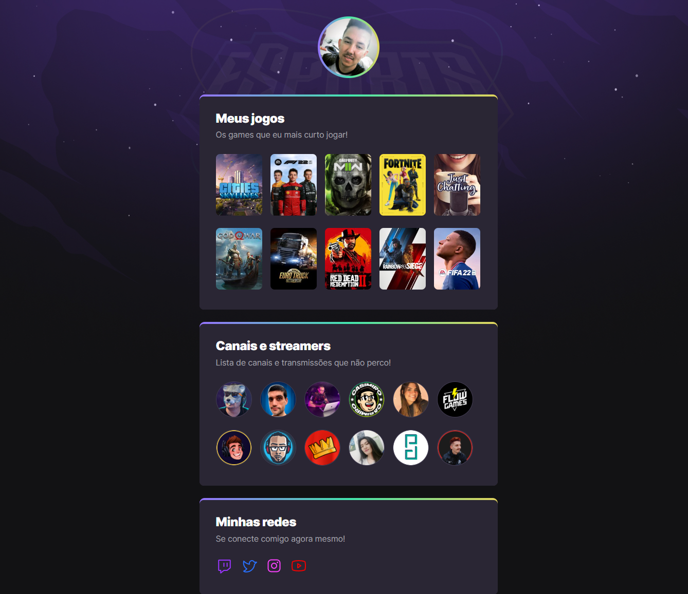

# nlw-esports

> Trilha Explorer
## 💻 Projeto

Este é um projeto desenvolvido durante a **[Next Level Week](https://nextlevelweek.com/)**, realizada pela **[@Rocketseat](https://github.com/Rocketseat)** durante os dias 11 a 18 de Setembro de 2022.

[🔗 Clique aqui para acessar](https://lucasllimati.github.io/nlw-esports/)

## 📄 Layout

Você pode visualizar o layout do projeto através dos links abaixo:

[🔗 Clique aqui para acessar](https://www.figma.com/community/file/1150897317533332617)

Lembrando que você precisa ter uma conta no [Figma](http://figma.com/) para acessá-lo.

## 📚 Tecnologias

- HTML
- CSS
- Git e Github

## 📇 Contato

## 📝 Licença

Esse projeto está sob a licença MIT. Veja o arquivo [LICENSE](LICENSE.md) para mais detalhes.

## 👏 Agradecimento

Agradeço a Rocketseat por esse primeiro passo na jornada como futuro desenvolvedor e espero os novos desafios.

---

Desenvolvido com por Lucas Lima
